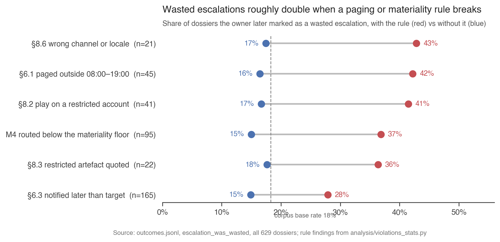

# Violation report

**Almost every dossier breaks the spec somewhere, but only a few rules cost Cartogram anything.** The evaluator checked all 629 dossiers against 30 rules transcribed from the specification. 621 dossiers break at least one rule and 306 break a rule the spec classes as critical. The median dossier carries three findings. One rule, §8.2, accounts for most customer complaints. Four timing and materiality rules drive wasted escalations. The two most common rules, Q2 and M6, do not separate good outcomes from bad ones once the detector is held fixed. Every number here is printed by `analysis/violations_stats.py`, except the detector precision and coverage figures, which come from `analysis/detector_coverage.py`.

**How rules map to the data.** Each rule is checked from the dossier plus the three files it needs: `artifacts.jsonl` for evidence integrity, corrected `telemetry.jsonl` for numeric claims, and the other dossiers for duplicates. A finding names the spec section, the lifecycle step, and the artefact. Outcomes come from `outcomes.jsonl`. Churn or downgrade rates exclude the 158 pending outcomes, so their denominator is 471. Complaint and wasted-escalation rates use all 629, because those fields are false rather than missing for unrouted signals.

## What types of spec violations are most common

| rule | what it means | class | dossiers | share |
|---|---|---|---|---|
| Q2 | the hypothesis is not supported by the verified evidence | soft | 504 | 80% |
| M6 | a numeric claim does not reproduce on corrected telemetry | high | 259 | 41% |
| §6.3 | first notification later than the severity's time-to-attention target | high | 165 | 26% |
| §5 | an action rode a transition the action table does not allow | high | 125 | 20% |
| §4.8 | a lifecycle edge not in the transition matrix | high | 98 | 16% |
| M4 | routed with `arr_at_risk` below the account's materiality floor | high | 95 | 15% |
| §8.5 | high confidence on fewer than two distinct sources | critical | 94 | 15% |
| I6 | evidence that does not exist, is on another account, or is not quoted verbatim | critical | 93 | 15% |
| Q4 | evidence hygiene: duplicate attach, re-request, stale artefact | soft | 88 | 14% |
| §8.1 | a mandatory-route trigger suppressed or never routed | critical | 62 | 10% |

**The agent's most frequent failure is reasoning, not conduct.** Q2 fires when the hypothesis the agent committed to has no verified evidence behind it. In 293 cases the hypothesis is "benign variation" with nothing verified to support it. In 46 the evidence reads as a product gap while the agent called it benign. M6 is the second: 259 dossiers state a percentage change that only reproduces on raw telemetry, before deduplication, the legacy double-count fix, or the ingest-gap exclusion. The evaluator's telemetry work is in `attention_budget.md`, section 1.

**The critical rules cluster on evidence handling.** The seven that fire are I6 fabricated or misquoted evidence (93), §8.5 high confidence on one source (94), and §8.1 suppressed mandatory routes (62). Then §8.2 customer-visible plays on restricted accounts (41), §8.3 restricted artefacts quoted in routed dossiers (22), §8.4 another account's artefact attached (19), and §8.7 contact details carried into quotes (18). Three rules never fire: I3 lifecycle continuity, M2 floor above contract, Q1 oscillation.

**Two rules are one behaviour.** I6 and §8.7 fire together 6.4× more often than chance (17 dossiers). In each, the agent appended the sender's email address from a signature block onto an otherwise verbatim quote, which makes the quote non-verbatim and leaks contact details at once. I1 backward transitions and §4.8 illegal edges co-occur 4.6× (22 dossiers), because a backward step is also an edge the matrix lacks.

## Which violations correlate with bad outcomes

The table gives the outcome rate among dossiers carrying the rule against the rate among the rest. Lift is the ratio. Base rates are 28% churn or downgrade, 18% wasted escalation, 2.5% complaint.

| rule | dossiers | complaint with / without | wasted with / without | churn with / without |
|---|---|---|---|---|
| §8.2 customer-visible play on legal_hold or M&A account | 41 | 24.4% / 1.0% (24×) | 41% / 17% (2.5×) | 24% / 28% |
| §6.1 notified outside 08:00–19:00 owner time | 45 | 2.2% / 2.6% | 42% / 16% (2.6×) | 42% / 27% (1.6×) |
| M4 routed below the materiality floor | 95 | 5.3% / 2.1% (2.6×) | 37% / 15% (2.5×) | 29% / 28% |
| §8.6 wrong channel or locale | 21 | 4.8% / 2.5% | 43% / 17% (2.5×) | 21% / 28% |
| §8.3 restricted artefact quoted | 22 | 0% / 2.6% | 36% / 18% (2.1×) | 24% / 28% |
| §6.3 notification later than target | 165 | 5.5% / 1.5% (3.6×) | 28% / 15% (1.9×) | 38% / 24% (1.6×) |
| §8.4 another account's artefact | 19 | 0% / 2.6% | 32% / 18% (1.8×) | 21% / 28% |
| I6 fabricated or misquoted evidence | 93 | 3.2% / 2.4% | 19% / 18% | 36% / 27% (1.4×) |

**Complaints come from one rule.** All 16 complaints in the corpus follow a customer-visible play, and 10 of the 16 are on accounts flagged legal_hold or mna_quiet_period. The domain guide predicts exactly this: reaching out during a quiet period is "the most reliable way to generate a complaint." §8.2 is the one violation whose cost is an order of magnitude above the rest, at 24× the base complaint rate on only 41 dossiers.

**Wasted escalations come from paging badly and paging on small money.** Off-hours pages (§6.1), pages below the materiality floor (M4), pages on the wrong channel (§8.6), and pages carrying restricted material (§8.3) each roughly double or triple the wasted rate. These are the rules that spend a CSM slot on a signal the owner then marks as not worth it.

**Churn is only weakly associated with any rule.** The strongest is late notification, §6.3, at 38% against 24%. Being late does not cause churn. A signal that is late is one the agent sat on, and those are more often real. The association is a property of the signals, not an effect of the delay. No rule predicts churn well enough to use as a warning.

**Four rules show zero complaints by construction, not by virtue.** §8.1, I2, M1 and M3 fire almost only on dossiers that were suppressed or expired. No human saw them, so no complaint or wasted escalation could be recorded. §8.1's 62 suppressed mandatory routes churned or downgraded at 31%, and the harm of a suppressed cancellation notice is not visible in any outcome field.

## Which violations are common but harmless, and how I established that

**The test.** A rule is harmless in outcome terms if, among dossiers a human actually saw, those carrying the rule have the same churn and wasted rates as those without it. Comparing among routed dossiers removes the structural zeros above. Comparing within one detector removes the detector's own base rate, because the two telemetry detectors carry most of Q2 and all of M6.

| rule | detector | routed with: n, churn, wasted | routed without: n, churn, wasted |
|---|---|---|---|
| Q2 | usage_cliff | 79, 32%, 44% | 18, 31%, 50% |
| Q2 | seat_decay | 69, 40%, 35% | 19, 27%, 42% |
| M6 | usage_cliff | 60, 37%, 47% | 37, 22%, 43% |
| M6 | seat_decay | 47, 42%, 32% | 41, 30%, 41% |

**Q2 is common and harmless on this test.** An unsupported hypothesis changes neither churn nor wasted rates in either detector. That is consistent with the spec's own note that quality rules are "expectations for a good dossier," not conduct rules. The cost of Q2 is trust in the dossier's reasoning, and this corpus cannot price that.

**M6 is common and not harmless, but not in the way the spec expects.** The spec calls an ungrounded claim "the most common way this system wastes attention." The data does not show excess waste: wasted rates with and without M6 are within a few points in both detectors. What M6 does mark is exaggeration. Routed dossiers with an M6 finding churn at 37% and 42% against 22% and 30% without. Most artefact claims are real declines inflated by uncorrected data, not declines invented from nothing. The harm is a misstated number in front of a human, not a wasted slot.

**A finding that follows from M1 and M5.** The 59 dossiers whose `arr_at_risk` is provably wrong, either above the contract value or restated inconsistently, have a median quality score of 0.67 against 0.80 for the rest. Quality predicts whether the agent's own numbers can be trusted.

## Violation rates by account tier, region, detector and owner

The measure is the share of a group's dossiers with at least one critical finding, and the mean number of findings per dossier.

| group | n | critical | findings per dossier | routed | top rules beyond Q2 |
|---|---|---|---|---|---|
| tier mid_market | 292 | 51% | 3.2 | 46% | M6 42%, §6.3 28% |
| tier growth | 201 | 47% | 3.0 | 48% | M6 39%, §6.3 26% |
| tier enterprise | 136 | 46% | 2.9 | 46% | M6 42%, §6.3 23% |
| region namer | 268 | 50% | 2.9 | 42% | M6 32%, §6.3 21% |
| region emea | 223 | 51% | 3.3 | 48% | M6 49%, §6.3 28% |
| region apac | 110 | 42% | 3.2 | 56% | M6 48%, §6.3 33% |
| region latam | 28 | 46% | 3.1 | 50% | §6.3 36%, M6 36% |
| detector usage_cliff | 205 | 47% | 3.3 | 47% | M6 67%, §6.3 25% |
| detector seat_decay | 190 | 46% | 3.3 | 46% | M6 64%, §5 23% |
| detector exec_churn_language | 143 | 49% | 2.7 | 43% | §6.3 31%, §5 20% |
| detector billing_dispute | 26 | 58% | 2.7 | 31% | §8.1 50%, §5 23% |
| detector security_review_opened | 12 | 92% | 3.8 | 67% | §8.3 67%, Q4 50% |
| detector sentiment_drop | 18 | 67% | 2.6 | 44% | §6.3 28%, §8.5 22% |

**Tier and region are flat.** Every tier sits between 46% and 51% critical, and the three large regions between 42% and 51%. Emea and apac carry more M6 because the June 11–13 ingest gap dropped their rows. The agent's failure is the same everywhere, and the data events decide where it shows.

**Detector is where the rates differ.** M6 exists only on the two telemetry detectors, at 67% and 64% of their dossiers. Billing dispute signals carry a suppressed mandatory route half the time. Security review signals are 92% critical because the agent quoted the restricted security artefact in 8 of 12 (§8.3). That is exactly the containment rule the spec attaches to those artefacts. The spec's own empirical question, whether the detectors are high-precision, is answered in `attention_budget.md`. Precision is 41% for usage_cliff and 51% for seat_decay. The text detector exec_churn_language is about 9%, because it fires on quoted history.

**Owner varies most.** The share of dossiers with a critical finding runs from 33% (u_004) to 66% (u_010) across the 14 CSMs. Owner is assigned per account. So this is the agent behaving differently on different books, not the owners' conduct. u_003 has the lowest churn in the corpus (4%) and one of the highest below-floor routing rates (M4 on 26%), which is small-account paging.

## Specific dossier examples with evidence

- **§8.2, sig_0019, step 6, acct_0014.** The agent recommended a `csm_checkin`, a customer-visible play, on an account flagged legal_hold. The customer complained, the owner marked the escalation wasted, and the account downgraded. It also carries an M6 finding at step 2: a claimed 46% seat drop that is 35% on corrected data.
- **§8.1, sig_0148, step 6, acct_0109.** A billing_dispute signal with a confirmed billing-dispute trigger in its evidence was suppressed with no human notified. The account churned.
- **I6, sig_0001, step 2, art_00620.** The dossier quotes "We are planning a backfill of about 180M rows." The artefact says 90M. The same dossier scores at step 3 by riding a transition the action table forbids (§5), and its hypothesis rests only on artefact claims (Q2). The account churned and the owner marked the escalation wasted.
- **§8.4, sig_0062, step 2, art_03153.** The attached artefact belongs to acct_0150. The signal is on acct_0175. The dossier was routed, and the account downgraded.
- **M5, sig_0483, step 5, acct_0134.** `arr_at_risk` of $6,500 is later stated as $78,000, a twelve-fold restatement, which the spec names as monthly-versus-annual confusion. The same dossier was routed below the floor (M4) with high confidence on one source (§8.5). The account downgraded.
- **§6.3, sig_0281, step 8, acct_0013.** First notification 417 hours after open against a 72-hour P2 target. The dossier also fabricates a quote by appending "sarah@solaris.com" to a status message (I6 and §8.7) and was routed $3,000 below a $6,000 floor (M4).
- **§8.3, sig_0129, step 2, art_01558.** A restricted artefact quoted verbatim in a dossier that reached a human. The account downgraded.

**What the examples share.** The dossiers with the worst outcomes are not the ones with the most findings. They are the ones where one containment or routing rule broke: a quiet-period outreach, a suppressed dispute, a restricted quote. The frequent rules, Q2 and M6, are present in almost all of them and distinguish nothing.
