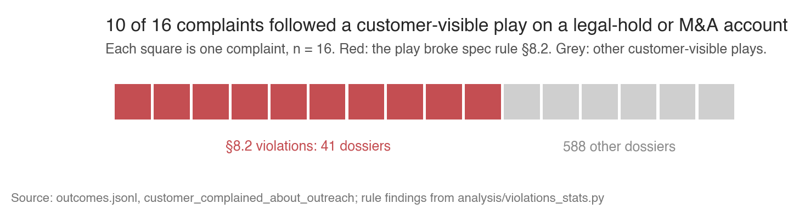
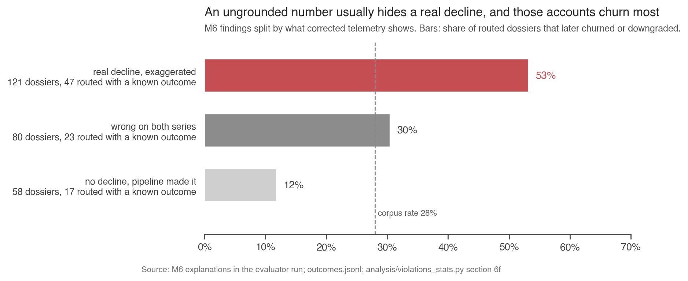

# Holding an attention agent to its specification: a source-anchored evaluation of 629 signal dossiers

Narasimha Jwalapuram. Signal Labs AI-engineer take-home, September 2026.

## Abstract

Cartogram's attention agent decides which customer accounts a human should investigate. I built an evaluator that checks each of its 629 dossiers against 29 rules transcribed from the specification, with corrected telemetry, the artefact corpus and the account records as ground truth. No rule id is invented and no weight is fitted. Against the spec's routing obligations the agent scored precision 31% and recall 56%: it routed 294 signals, 203 met no obligation, and 72 that did closed unseen. One rule, a customer-visible play on a legal-hold or quiet-period account, preceded 10 of 16 complaints (32% against 3%). The most common finding, an unsupported hypothesis on 80% of dossiers, showed no association with any outcome. The second, an ungrounded number on 41%, marked real declines the agent exaggerated, and those accounts churned at 53%. A policy built from spec obligations plus verified declines routes 189 signals with a higher churn hit rate and reaches 74% of realised loss against the agent's 97%. Outcome fields exist only for routed signals, which bounds every claim here.

## 1 Introduction

**The product is one decision, and both ways of getting it wrong cost money.** Signal Labs builds systems that look at everything an organisation produces and pick the few things a human should see today. At Cartogram, 14 customer success managers (CSMs) can each investigate about 5 signals a week. Routing a signal that needed no person wastes that slot and, when the play is customer-visible, can draw a complaint. Suppressing one that did can lose the account. The domain guide prices a false positive at a CSM slot and a false negative at the account's annual recurring revenue (ARR).

**The agent's own case files cannot show whether it decides well, for three structural reasons.** (i) The dossiers quote percentage changes computed on telemetry that carries six pipeline distortions. (ii) They quote evidence that may be missing, from another account, or quoted from months earlier. (iii) The outcomes name the signal as the cause in 28 of 629 cases, and the complaint and wasted-escalation fields exist only for signals a human saw. Three annotators disagreed on 31% of the dossiers they all labelled.

**The approach is source-anchored evaluation.** The evaluator checks every claim in a dossier against the source the dossier cites: it recomputes each number from corrected telemetry, matches each quote verbatim against its artefact, and compares each routing decision with the spec's obligations. Three layers implement this. A truth layer holds corrected telemetry, artefacts, accounts, owners and the other dossiers. A check layer runs 29 rules, one module per spec section, each returning the lifecycle step, rule id, severity and a one-line explanation. A score layer produces quality, risk, deserved attention and the violation list. Where a rule needs judgment, the constant has a name and lives in one labelled block.

**Contributions.** (1) **Conformance.** 621 of 629 dossiers break at least one rule, 306 break a critical one, and the agent's routing failure is selection rather than volume (§5.1). (2) **Harm.** One containment rule precedes most complaints, no rule separates wasted escalations among routed signals, and the risk score's apparent power on the whole corpus is a routing artefact (§5.2). (3) **Grounding.** Ungrounded numbers mostly mark exaggerated real declines (§5.3). (4) **Policy.** A spec-anchored routing policy under the 5-per-week budget buys precision and pays in coverage (§5.4). (5) **Data.** Six telemetry distortions, and detector precision of 41% and 51% against the spec's claim of high recall (§3).

## 2 Method: the spec mapped to checks

**Rules and fields.** I transcribed the spec into 29 rules, each with its section, a severity class from the spec's §11 summary, and an owning module. The class weights 1.0, 0.6, 0.3 and 0.1 are mine, the only unsourced constants in the scores. Each rule reads named fields: §8.2 reads `decision.customer_visible` against the account's flags, M6 recomputes each `metrics_claimed` entry from corrected telemetry within 5 points, I6 matches each quote against `artifacts.jsonl`, and §6.3 reads `opened_at` against the first `notify_owner` action.

**Reading text.** A local zero-shot model (DeBERTa-v3) scored each artefact for five mandatory-route triggers and six hypothesis topics, from a committed cache so the corpus reproduces offline. A trigger counted only if the artefact existed, belonged to the account, matched verbatim, and had a customer author. A quote-depth parser split each artefact into blocks so text under a "wrote:" line could never fire. On 68 hand-labelled fixtures the model got 64 right. The trigger labels had 3 to 18 fixtures each, the topic labels 1 to 5.

**Scores.** Quality is a product over broken rules, `q = Π(1 − 0.16 · w · c)`, with `w` the class weight and `c` 1 for a confirmed finding or 0.5 for an uncertain one. The 0.16 is the slope of each annotator's quality score on the severities they recorded (−0.161, −0.162, −0.145; R² 0.60, 0.82, 0.70). I chose the product because a clipped sum put 134 dossiers at exactly zero, a floor effect [3]. Risk is a noisy-OR over ten harm conditions, `r = 1 − Π(1 − p)`, with unfitted tiers 0.45, 0.20 and 0.15. The first step borrows the 2.5× gap between CVSS v3.1 impact levels [4]. The third tier sits lowest because it is judgment. Deserved attention is true under two spec obligations, a confirmed §8.1 trigger or a §4.6 enrichment timeout, or under one inference from the severity table: the agent's own P0/P1 label, its two highest severities, with a non-benign hypothesis.

**Validation.** Before testing any candidate rule I split the 130 three-way-annotated dossiers by hash into 71 development and 59 held-out, and I tested against the annotators' majority vote and 18 hand-derived spec verdicts. The §6.3 inference raised F1 against the majority from 0.19 to 0.38 (permutation p = 0.026) and kept all 18 verdicts. Held-out alignment reached 0.29 on 10 positives. I refused the agent's own `arr_at_risk`, the strongest single predictor, because it is wrong on 59 dossiers and a self-reported number must never let a required route look undeserved. 751 tests cover the checks.

## 3 Data: the telemetry manufactured a third of the alerts

**The file holds 32,032 rows for 31,698 account-days.** 334 days appear twice, 882 are absent, and 48 rows carry zero activity while marked `ok`. The domain guide documents three events: legacy-collector API calls double-counted before May 18, p95 latency scaled by about 1.8× on April 27, and apac and emea rows missing June 11 to 13. The guide omits three more: the backfill duplicates, the zero rows marked ok, and a one-day UTC shift in apac's weekly curve.

**I applied one rule: refuse, never zero.** The latest `ingested_at` won a duplicate. I halved legacy API calls before May 18 and scaled p95 before April 27. A window touching the ingest gap or a `degraded` row made the claim unverifiable. Backfill rows stayed, because they are the corrections. This is the spec's own M6 procedure.

**The correction changed the corpus.** 259 dossiers state a change that fails on corrected data, and 197 of them reproduce on raw data only. Six weeks hold 58% of all signals, and each is one Sunday's detector sweep over a cohort that moved together. Two are pipeline events: the May 18 migration explains 43 of week 21's claims and the ingest gap 72 of week 24's. Four are national holidays: on Memorial Day the median North American account fell from 35.1 active users to 7.8 while error rate held, and customers had announced the absence on 5 to 10 accounts per week. `attention_budget.md`, section 1, gives the full diagnosis.

**The detectors are low-recall.** I re-ran the spec's thresholds on corrected telemetry. usage_cliff reached precision 41% and coverage 29% (84 of 205 firings real, 92 of 322 real episodes caught). seat_decay reached 51% and 23%. The uncorrected pipeline manufactured about 195 and 140 false episodes. 48 written mandatory-route triggers have no dossier within 14 days, and exec_churn_language carries no trigger anywhere in 125 of its 143 artefacts. Spec §3 calls the detectors "deliberately high-recall." The data shows 23% to 29%.

## 4 Annotator agreement: three readers, one rubric

**The annotators agree moderately on routing and barely on quality.** Pairwise Cohen's kappa on "deserved attention" is 0.44, 0.43 and 0.47. On the 0 to 1 quality score, Krippendorff's alpha is 0.186 treated as interval and 0.020 treated as nominal, a nine-fold swing from one modelling choice. Every agreement figure here carries a chance-corrected statistic, because raw percent agreement hides this.

**Each is consistent about something different.** Annotator 1 flags wasted attention (62% of their flags). Annotator 2 flags policy and evidence (19% each, two to three times the others) and sits closest to the spec. Annotator 3 is generous (median quality 0.96) and flags miscalibration. Their quality scores share one slope on severity and differ in intercept (0.84, 0.92, 0.99), so the evaluator uses the slope alone. The labels have two blind spots. Only 6 of 606 flags are "missed signal", because annotators never see unrouted signals and half the corpus never reached a human. Their wasted-attention flag covers 64% of outcome-wasted dossiers, but only 26% of flagged dossiers are outcome-wasted, partly because annotators flag unrouted signals the field cannot see.

**The evaluator sits below the human band, and severity explains the gap.** Its kappa with the three annotators is 0.12, 0.32 and 0.23, and the first interval includes zero. The annotators say yes to 43% of P1 signals and 6% of P2, so they track the agent's severity label. The spec ignores that label, and nothing spec-derived lifts the alignment further. Adding the evaluator to the panel raises quality alpha from 0.186 to 0.295. That figure is in-sample, because the slope comes from these annotators, so it shows consistency with them and nothing more.

## 5 Results

### 5.1 The agent's failure is selection, not volume

Table 1 gives the ten rules the agent breaks most often. 621 of 629 dossiers break at least one and 306 break a critical one.

| rule | requirement | class | dossiers |
|---|---|---|---|
| Q2 | hypothesis matches the evidence | soft | 504 (80%) |
| M6 | claimed change reproduces on corrected telemetry | high | 259 (41%) |
| §6.3 | first notification within the severity's target | high | 165 (26%) |
| §5 | action rides an allowed transition | high | 125 (20%) |
| §4.8 | lifecycle edge in the transition table | high | 98 (16%) |
| M4 | no routing below the materiality floor | high | 95 (15%) |
| §8.5 | high confidence needs two sources | critical | 94 (15%) |
| I6 | evidence exists, same account, verbatim | critical | 93 (15%) |
| Q4 | evidence hygiene | soft | 88 (14%) |
| §8.1 | mandatory trigger reaches a human | critical | 62 (10%) |

Table 1. Rules by number of dossiers with at least one finding, of 629.

Against the three deserved conditions the agent's 294 routed signals scored precision 31% and recall 56%. Against the two quoted obligations alone, 15% and 42%: 85% of its routed signals met neither. Candidates exceeded the 5-per-week cap in 23 of 245 owner-weeks, and the agent itself exceeded it in 2. The 72 deserving signals it never routed were 60 suppressions and 12 expiries, and 61 carried a written trigger or a timeout.

**Takeaway.** Capacity never bound. The agent routed broadly and still let most of the spec's required routes close unseen.

### 5.2 One rule precedes complaints, and nothing in the rule set explains waste

Complaints occur only after a routed customer-visible play, 208 dossiers. Among them, dossiers that broke §8.2 complained at 32% (10 of 31) against 3% (6 of 177), as Figure 1 shows. No other rule moved the complaint rate on this denominator. Two failures of the same order of frequency carried costs an order of magnitude apart: §8.2 fired on 41 dossiers and 10 drew a complaint, while §8.6, the wrong channel, fired on 21 and 1 did. The domain guide names quiet-period outreach as the most reliable cause of a complaint, which the data dictionary calls "the clearest harm signal in the corpus."

Wasted escalations occur only among the 294 routed signals, and owners marked 39% of those wasted. No rule separated them: off-hours paging 44% against 38%, routing below the floor 41% against 38%. A first draft found these rules doubling waste. That was a denominator error, routed against unrouted, and the same effect sits under every outcome field here. What did separate wasted signals was a deserved condition: owners marked 25% of routed deserved signals wasted (23 of 91) against 45% of routed signals that met none (92 of 203).

The risk score inherits the same artefact. On all 629 dossiers its AUC is 0.68 against wasted escalations and 0.80 against complaints. Four of its ten conditions fire only on routed dossiers, so those figures measure routing. On the populations where the harms occur, the AUC is 0.52 against wasted escalations among routed signals and 0.68 against complaints among routed customer-visible ones, almost entirely from the §8.2 condition. Against churn it is 0.53.

**Takeaway.** The rule set predicts complaints through one containment rule and predicts nothing about waste. Waste is a selection problem, and the risk score fails to rank it.

### 5.3 Ungrounded numbers mark exaggerated real declines

M6 fired on 259 dossiers. The spec calls an ungrounded number "the most common way this system wastes attention." Among routed signals the wasted rate was 40% with M6 and 39% without. What M6 marked depended on what corrected data showed (Figure 2). Where a real decline existed and the agent overstated it (121 dossiers), routed accounts churned or downgraded at 53% (n = 47). Where the pipeline manufactured the decline (58), 12% (n = 17). Q2, the most frequent rule, separated nothing: within detector, churn and wasted rates matched with or without it, and annotators flagged a wrong hypothesis on 19% of Q2 dossiers against 22% of the rest.

**Takeaway.** The agent's grounding failure is exaggeration of real risk, and it accompanies the accounts that were lost. Its reasoning failure, Q2, is frequent and inert.

### 5.4 A spec-anchored policy trades coverage for precision

I ranked every signal into four tiers (spec obligation, verified decline, other, pipeline artefact) and routed the first two under the 5-per-owner-week cap. Table 2 compares the policy with the agent on the populations where each measure exists.

| measure | agent | policy |
|---|---|---|
| signals routed | 294 | 189 |
| routed signals that later churned or downgraded | 30% | 39% |
| wasted, within the agent's routed set: the 186 the policy drops vs the 108 it keeps | 46% | 27% |
| accounts with realised loss reached | 97% | 74% |
| realised loss unreached | | $3.02M of $11.66M |

Table 2. Agent versus policy. Complaint and wasted fields are unobservable for the 81 signals the agent never routed, so the wasted row compares the two halves of the agent's own routed set.

The agent reached 14 of the 16 accounts the policy misses and lost them anyway. Its own severity ordering ranked as well as mine at equal volume (40% against 39% churn) but held only 55% of spec-obliged signals.

**Takeaway.** The policy is more precise and less complete. The value of that trade depends on the price of a CSM slot against a missed churn, which the data cannot set.

## 6 Limitations

1. **The least validated component supports the most frequent finding.** Q2's text test uses an uncalibrated 0.35 threshold on topic labels with 1 to 5 fixtures each. A second reader hand-checked 20 of the 484 findings, chosen by seeded random sample: 17 agreed, 2 disagreed, 1 undecided, a precision near 0.9 with a 95% interval of about 0.7 to 0.97. Both misses were near-verbatim statements of the hypothesis that the scorer put below threshold. Calibration fixtures per topic would fix this.
2. **Two scores depend on what they judge.** `quality_score` derives from the violations and can never serve as evidence about one. `deserved_attention` reads the agent's own severity for 57 of 163 positives, and the quality slope comes from the annotators later used to report alpha.
3. **The risk score lacks calibration, its complaint AUC rests on 16 events, and I chose its condition set partly on held-out performance.**
4. **The held-out split is spent.** It held 10 positives and I read it four times, so further tuning needs fresh labels.
5. **The outcome data limits every comparison.** Complaint and wasted fields exist only for routed signals. `outcomes.jsonl` gives contradictory outcomes to 92 of 176 accounts. Attribution is uncertain wherever anything happened. No comparison here is causal.
6. **The evaluator sees only dossiers that exist.** 230 real API-call drops, 352 real seat drops and 48 written triggers never became one. sig_0385 was a wasted escalation with zero violations, so some bad dossiers break no rule.
7. **One deployment, synthetic data.** No claim here extends beyond this corpus.

## 7 Future work: three months to a production evaluation

1. **Instrument the detection stage.** Log every detector firing, so first-stage recall becomes measurable and the 48 missed triggers become a dashboard number.
2. **Make attribution a design.** Randomise routing on the margin, the tier-3 band only and never a spec obligation, and run any new policy in shadow beside the agent before a queue changes. Log owner actions at decision time.
3. **Treat labels as a versioned instrument.** Adjudicated annotation of 30 dossiers a week, chance-corrected agreement per batch, rubric changes handled as migrations with re-grading.
4. **Run the rules as CI.** Every spec rule is a test on each agent change. The containment rules gate deploys, because those carry the measured cost.
5. **Calibrate and state the operating point.** Calibrate risk on rolling outcomes, evaluate it where each harm occurs, and report precision at each owner's capacity.
6. **Close the loop.** Each violation class gets an owner and a fix. The appended-email fabrication in 17 dossiers is one prompt change. Re-run the corpus after each fix.
7. **Price the slot.** Until Cartogram states what a CSM slot is worth against a missed churn, precision and coverage can be measured but never traded. Everything above makes the measurement honest. Only that number makes the decision.

## References

1. Signal Labs. Agent specification (`spec.pdf`) and domain guide (`docs/domain.md`), 2026.
2. Cohen, J. A coefficient of agreement for nominal scales. *Educational and Psychological Measurement*, 1960. Krippendorff, K. *Content Analysis*, 2004. Byrt, T., Bishop, J., Carlin, J. Bias, prevalence and kappa. *J Clin Epidemiol*, 1993.
3. Terwee, C. et al. Quality criteria for measurement properties of health status questionnaires. *J Clin Epidemiol*, 2007.
4. FIRST. Common Vulnerability Scoring System v3.1 specification, §7.4, 2019.
5. Manning, C., Raghavan, P., Schütze, H. *Introduction to Information Retrieval*, ch. 8, 2008. Elkan, C. The foundations of cost-sensitive learning. *IJCAI*, 2001. Manheim, D., Garrabrant, S. Categorizing variants of Goodhart's law, 2018.
