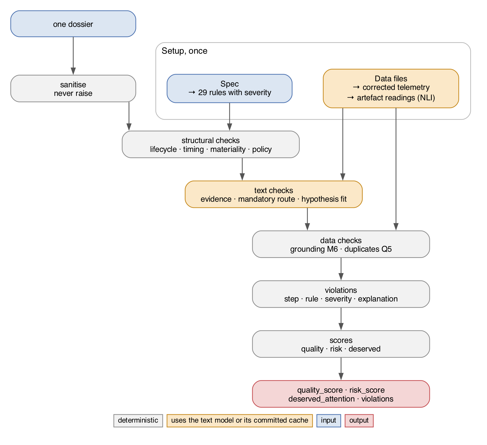
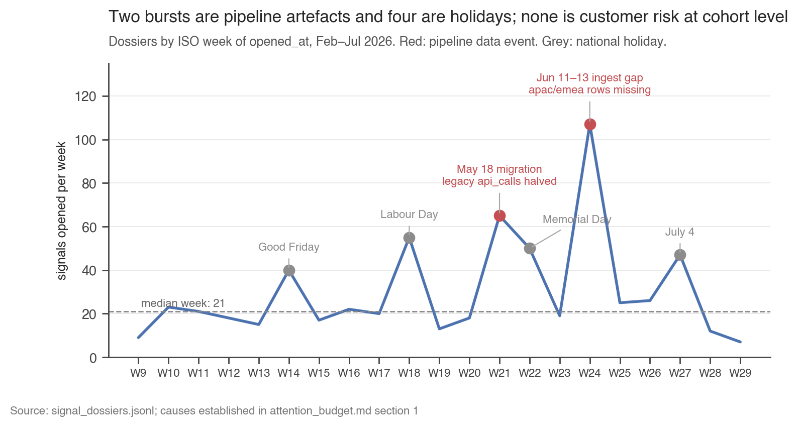

# Evaluating Cartogram's attention agent against its specification

## Setup

**What Signal Labs builds.** Signal Labs builds the layer that decides which few things a human must look at today. At Cartogram, the fictional customer in this assignment, that layer is an account-risk attention agent.

**What the agent does.** The agent watches 180 customer accounts. It reads product telemetry: daily metrics such as active seats and API calls. It reads text artefacts: tickets, email, chat, CRM notes, meeting notes, surveys, security reviews, billing events and monitoring alerts. When one of eight detectors fires, the agent opens a signal. It then:

1. Gathers evidence.
2. Forms a hypothesis about the cause.
3. Assigns a severity and a confidence.
4. Routes the signal to the account owner, a customer success manager (CSM), or suppresses it.

A dossier is the full record of one signal. It lists each state, each attached artefact with its quote, each numeric claim, each action, each notification, and the final decision.

**What we received.**

- A specification. It defines the agent as a state machine over the life of a signal. It adds invariants, timing targets, policy and containment rules, materiality rules, grounding rules for numeric claims, and quality expectations.
- 629 dossiers from a 21-week period.
- Telemetry: 32,032 account-day rows.
- 3,810 text artefacts, plus the account and owner records.
- Renewal outcomes observed after the period.
- Quality labels from three annotators. Each labelled 240 dossiers.

**What we had to build.** An evaluator that takes one dossier and returns a quality score, a risk score, a deserved-attention verdict, and the list of rules the dossier broke. On top of it: a violation report, an attention-budget analysis, and this writeup.

**Why this is hard.** The contents of a dossier do not show whether it is correct:

- The agent quotes percentage changes computed on telemetry that carries pipeline distortions.
- It quotes evidence that can be missing or from another account.
- It reports its own ARR-at-risk figure.
- The outcomes name the signal as the cause in only 28 of 629 cases.
- The complaint and wasted-escalation fields exist only for signals a human saw.
- The three annotators disagreed on 31% of the dossiers they all labelled.

The evaluator must check every claim in a dossier against the source it cites. Every number in this writeup names the population it rests on.

## Methodology

**The evaluator is a source-anchored audit.** It recomputes what the agent claimed from the data the agent cited. Figure 1 shows the path one dossier takes. The evaluator builds two things once: a rule table from the specification, and a truth layer from the data files. Each dossier then passes through eleven checks, which emit violations. Three scores come from the violations and from facts the checks record.

*Figure 1. The path one dossier takes through the evaluator.*

### From the specification to 29 rules

- I read the specification once and transcribed it into a table of 29 rules.
- Each rule carries the identifier the specification uses, for example I6 (evidence integrity), M6 (grounding of numeric claims) or §8.2 (legal-hold containment).
- Each rule also carries its section, a severity class, and the check that owns it.
- The severity classes come from the specification's summary table in §11. It calls invariant violations, fabricated evidence, containment failures and missed mandatory routes critical. It calls invalid transitions and materiality or grounding errors high. It calls timing failures medium to high and quality failures variable.
- I mapped those words to four weights: critical 1.0, high 0.6, medium 0.3, soft 0.1.
- The code documents two departures. §8.6 (wrong notification channel) is soft because the specification calls it low-severity. Timing splits: the time-to-attention target and the re-notification limit are high, the notification window and the staleness rule are medium.
- Nothing parses the PDF at run time. A hand-written table is easier to audit than a parser.
- Seven tests parse the section numbers of the LaTeX source. They fail in three cases. A rule cites a section that does not exist. An emitted identifier is absent from the specification. A coined name has no entry in the definitions file.

### The truth layer

The optional `load_context` call receives the accounts, owners, telemetry, artefacts and the other dossiers. It indexes the records by identifier. It corrects the telemetry in five ordered steps:

1. Where an account-day appears twice, the row with the later ingestion time wins. The later row is a backfill.
2. For accounts on the legacy collector, halve API calls before 18 May 2026. The collector double-counted until that date.
3. Multiply the p95 latency before 27 April by 1.8. The instrumentation changed on that date.
4. Mark as unusable any row where seats, API calls and data volume are all zero while the status reads ok. Mark degraded rows the same way.
5. Leave missing days missing.

Step 5 matters most. A naive reader fills a missing day with zero and sees a collapse. The evaluator refuses to compute a number over a window it cannot see.

To recompute a percentage change, the evaluator pairs each day in the claimed window with the same weekday one window earlier. It sums only the pairs where both days are usable. Weekends, missing days and the apac time-zone shift then cancel.

The truth layer also builds a cohort baseline for each account. The baseline is the median change of its industry or region peers over the same days, excluding the account itself. A drop the whole cohort shares then reads as a calendar or pipeline event.

### Reading the text

Artefacts are messy. Quoted email history repeats old complaints under a new positive message. Signatures carry contact details. Sarcasm defuses complaints. The reader has four parts.

**1. Quote-depth splitter.** The evaluator splits each artefact at quote boundaries. It tags as quoted history any text under a "wrote:" line, below a forwarded-message divider, or prefixed with ">". Quoted history can never fire a trigger. The splitter is a set of regular expressions over the conventions this corpus uses. It tags trailing signatures the same way.

**2. Zero-shot NLI model.** A natural-language-inference (NLI) model takes a passage and a written sentence. It returns how strongly the passage entails the sentence. Zero-shot means the model was never trained on this corpus. I chose DeBERTa-v3-base fine-tuned for zero-shot classification [5] (184 million parameters, runs offline) from a bake-off of three candidates on hand-written fixtures. It separated 11 of 12 labels with bimodal scores and read German, Spanish, Portuguese and Japanese cancellation notices correctly. A multilingual NLI model scored almost everything near 1.0 and separated 7 of 12.

**3. Labels and thresholds.** The model scores twelve labels: five mandatory-route triggers from §8.1, sarcasm, and six hypothesis topics from §3.2. The triggers are cancellation intent, legal reference, security incident, champion departure and billing dispute. Each label has several written sentences and takes the highest score, so recall does not depend on one phrasing. A score becomes True above an upper threshold, False below a lower one, and abstain between them. I calibrated the thresholds on one half of 176 fixtures and checked them on the other half. The model got 64 of 68 right, with 2 abstentions.

**4. Structural gates.** Four gates sit in front of every model verdict:

- The artefact must exist and belong to the account.
- The quote must appear verbatim.
- The block must be current, not quoted history.
- A cancellation or security trigger must come from a customer author.

A committed cache holds the 43,679 scores for this corpus. The grader's machine reproduces every result with no model download. The model sits behind a four-line interface, so any scorer can replace it. With neither model nor cache, the evaluator marks the four text-dependent rules as unevaluated and returns everything else.

### Why rules and a small model, and not an LLM judge

I chose rules plus a small offline model over a large language model (LLM) judge. Three reasons.

1. **Cost and the run constraint.** The README forbids external API calls inside `evaluate()`. The evaluator runs on the grader's machine. A rule check with a small offline model costs nothing per dossier. The corpus runs in about two minutes from the committed cache. An LLM judge costs one call per artefact per rule. It cannot run offline without a large local model.
2. **Auditability.** A rule cites a spec sentence and gives the same answer on every run. An LLM judge gives a verdict that can change between runs. It would need the same annotator comparison before anyone could trust it. The evaluator would then validate a judge instead of the agent.
3. **It was enough.** 25 of the 29 rules are pure logic and need no model. The model reads text for four rules only. On that task the small model got 64 of 68 fixtures right. On quality the evaluator reaches the human band with no LLM.

**Where an LLM would earn its cost.** The weak spot is the hypothesis-fit rule Q2. It rests on the least calibrated labels. That is the first place an LLM judge goes in the three-month plan. It sits behind the same four gates, and it ships only after it beats the small model on the same fixtures.

### The eleven checks

The evaluator first coerces the dossier into the expected shape and records what it changed. A malformed field can never hide findings on valid fields. Nothing in `evaluate()` raises. The checks then run in this order:

| check                                                    | rules                      | needs            |
| -------------------------------------------------------- | -------------------------- | ---------------- |
| lifecycle (a finite-state acceptor over the transitions) | I1, I2, I3, §4.8          | dossier          |
| actions against their allowed transitions                | §5                        | dossier          |
| hypothesis count                                         | I5                         | dossier          |
| timing, in the owner's local time zone                   | §6.1 to §6.4, §8.6      | owner record     |
| materiality arithmetic                                   | M1 to M5                   | account record   |
| evidence integrity                                       | I6, §8.4, Q4 (staleness)  | artefacts, model |
| policy and containment                                   | §8.2, §8.3, §8.5, §8.7 | account record   |
| grounding on corrected telemetry                         | M6                         | telemetry        |
| duplicates across the other dossiers                     | Q5                         | other dossiers   |
| mandatory route                                          | §8.1                      | artefacts, model |
| hypothesis quality                                       | Q1 to Q4                   | telemetry, model |

Eight checks are pure logic. Three consume model verdicts: evidence staleness, the mandatory route, and the hypothesis-fit rule Q2.

Each violation is a record of four fields: the lifecycle step, the rule identifier, a severity, and a one-line explanation. The explanation names the offending identifiers and numbers. Example: "api_calls claimed −61% reproduces only on uncorrected data (raw −58.2%, paired +1.3% on 7 of 7 pairs), manufactured decline". Severity is the class weight, halved when the finding is uncertain. An uncertain finding is, for example, a trigger the model abstained on, or a departure the evaluator could not attribute to a named person. Magnitude lives in the explanation and never changes severity.

A second entry point, `explain()`, returns the same result plus 31 recorded facts. Examples: which triggers fired and from which artefact, whether the signal reached a human, the status of each numeric claim, and the cohort match. Every analysis script reads those facts instead of re-deriving them.

### How the three scores were built

All three scores came from one five-step loop. The loop follows EvalGen's grade-then-refine procedure [6] and the development/unseen split discipline of Tülu 3 [7]. I ran it once for each score.

1. **Source criteria from breakage.** Write the score from the specification alone. Run it on all 629 dossiers. List where it breaks: a floor, a zero-agreement statistic, or a baseline that beats it. The checks come from observed failures.
2. **Grade, and let the criteria move.** Score each candidate condition against the annotators' majority vote. Use an alignment measure with a false-failure ceiling fixed before scoring. Alignment is the harmonic mean of coverage and one minus the false-failure rate [6].
3. **Version, do not freeze.** Split the labelled dossiers once, by hash, before any candidate exists. Tune only on the development half. Read the held-out half once. Treat each change as a new version. Re-grade the golden dossiers under it.
4. **Read the disagreement per slice.** Report agreement pairwise. Never pool the evaluator into the human panel. Report PABAK beside kappa. Report each statistic per severity, per detector and per disposition. In every case the diagnosis came from a slice.
5. **Diagnose which failure it is.** A wrong verdict can come from the reader: the text model scored a sentence below threshold. Or it can come from the rule: the rule cannot express the case. The fix differs for each, and each recorded failure names which one it was.

In this section "rejected" has one meaning. I built or measured the candidate, it failed a stated test at one of these steps, and I recorded the failure. The subsections below give that record for each score.

### The quality score

The formula is

    quality = Π over broken rules of (1 − 0.16 · w · c)

where w is the class weight (1.0, 0.6, 0.3 or 0.1). c is 1 for a confirmed finding and 0.5 for an uncertain one. There is one penalty per rule.

**The ranking came from the rules first.** I designed the rule table and the severity classes from the specification alone. With placeholder penalties the score already ranked dossiers the way the annotators did: Spearman 0.34, 0.54 and 0.40. Each step below changed the scale or the floor. None changed that ranking by more than 0.02.

**Step 1: forms that traced to nothing.** Placeholder penalties chosen by feel, a hard zero on any critical violation, and a floor of 0.25. The gate was rejected on evidence: the annotators' minimum scores are 0.30, 0.27 and 0.88, and none of them ever scored zero, not even on fabricated evidence. It also merges quality (how well the dossier was built) with risk (how much harm it can cause). The other two had no source.

**Step 2: a sum of penalties, clipped at zero.** The annotators' own scoring suggested it. Regressing each annotator's quality on the severities they recorded gives a straight line, with slopes −0.161, −0.162 and −0.145 and R² 0.60, 0.82 and 0.70. Result: 134 of 629 dossiers (21%) sat at exactly 0.0, two with no critical violation. sig_0313 broke six soft rules and scored the same as a dossier with fabricated evidence. Terwee and colleagues [3] call more than 15% at the lowest value a floor effect. Rejected.

**Step 3: the product.** The form the Common Vulnerability Scoring System uses for its impact sub-score [4]. It can approach zero but cannot reach it by accumulation. Result: dossiers at the floor fell from 134 to 1, distinct values rose from 35 to 109, and Spearman against each annotator moved by less than 0.015. Kept.

**Step 4: the magnitude.** The product still charged 0.50 per critical finding, three times the annotators' slope, and the evaluator's median sat 0.29 below every annotator. I replaced the 0.50 with the one number the three annotators agree on, the slope 0.16, and kept the specification's 10:6:3:1 class ratios. Result: median 0.54 to 0.80 against annotator medians 0.80, 0.83 and 0.96. Mean absolute error 0.32 to 0.12, inside the 0.11 to 0.17 the annotators show against each other. Spearman between old and new scores is 0.96, so this was a rescale. The annotators agree on the cost of a finding to within 0.017 and disagree on their baseline by 0.15, which is why only the slope was borrowed.

**What is in-sample.** The slope was fitted to these annotators, so bias, mean absolute error and alpha are partly in-sample. Spearman is not, because the ranking came from the rules.

### The deserved-attention verdict

The specification never defines what deserves attention. It states two obligations: §8.1 lists five triggers that must reach a human, and §4.6 says a signal whose enrichment timed out must still reach a human. The shipped verdict is those two rows plus one inference from §6.3. It fires on 163 of 629 dossiers.

**Step 1: invented conditions.** The first version had eight conditions, one from the specification, and fired on 215 dossiers, including a 25-day-old feature request marked "not urgent". Rejected: an evaluator that invents obligations has no defence against the document it audits.

**Step 2: the two obligations, measured.** This version fired on 106. Against the three annotators its Cohen's kappa was 0.04, 0.10 and 0.02, all intervals crossing zero, which means no agreement. Its F1 against the majority vote was 0.19. Trivial baselines beat it: every P0 or P1 signal scored 0.57, every non-benign hypothesis 0.57, copying the agent's routing 0.40. Three additions were tested and rejected here. A materiality gate raised agreement five points but reads the agent's own ARR figure, which is wrong on 61 dossiers. A "severely below the floor" threshold degraded smoothly with no cliff to defend. A gate on high-quality dossiers chains three outputs into one.

**Step 3: a pre-registered split, then candidates.** Before generating any candidate I split the 130 dossiers all three annotators labelled into 71 development and 59 held-out by hashing the signal id [7]. Candidates were scored with EvalGen's alignment, the harmonic mean of coverage and one minus the false-failure rate, under a false-failure ceiling of 0.55 fixed before scoring [6]. The first survivor scored 0.39 on development and 0.09 on held-out. Rejected: the split caught an overfit. A conjunction, P0 or P1 with a non-benign hypothesis, cleared the ceiling on both halves but failed two of the 18 golden verdicts, because §8.1 bounds a departure claim to 90 days before renewal.

**Step 4: the full sweep.** Every one- and two-term combination of 14 predicates, OR'd onto the spec rule, 106 policies. Each was tested against the majority vote with a permutation test, which shuffles the labels 3,000 times to price chance. Survivors had to clear the ceiling on both halves and keep 18 of 18 goldens. Result: every evidence-only predicate was noise, p between 0.15 and 0.42. The only real signal was the agent's own severity. That is not circular, because §6.3 says P0 means act today and P1 means material risk with corroboration.

**Step 5: the shipped row.** The agent assigned P0 or P1 with a non-benign hypothesis, and a departure claim sits inside the 90-day window. Result: F1 against the majority rose from 0.19 to 0.38 (permutation p = 0.026), 18 of 18 goldens held, kappa rose to 0.12, 0.32 and 0.23. Held-out alignment was 0.29, which clears no ceiling and is recorded as such. The code marks the row as an inference.

**One predictor refused.** The agent's own ARR-at-risk figure, as "at risk is at least 10% of annual", was the strongest held-out signal (p below 0.001) and is wrong on 59 dossiers. Used as an AND it vetoes sig_0350, a golden true via §4.6. Reading a self-report to add coverage is safe. Reading one to withhold a required route is not [8]. A test asserts the verdict never reads the field.

### The risk score

Risk is the probability that the dossier causes one of three harms: a customer complaint, a wasted CSM slot, or a missed churn. The shipped score is a noisy-OR over ten conditions,

    risk = 1 − Π over fired conditions of (1 − p_i · c_i)

with p_i the tier probability and c_i the same certainty factor as above.

**Step 1: what was rejected first.** Seven additive terms whose coefficients cited nothing. Fitting the coefficients to outcomes, because 16 complaints cannot support a weight per rule and an evaluator that runs on unseen dossiers must not encode one sample's accidents. A per-tier multiplier, because tier changes how expensive a missed churn is, not how likely, and the README defines the field as a probability. A sum, because 15 of the 16 complaints fire two conditions at once, so a sum charges one event twice.

**Step 2: the noisy-OR and its conditions.** A noisy-OR combines independent causes of one outcome and stays in [0, 1]. It has a precedent in medical diagnosis [9] and in Signal Labs' own material [1]. A condition qualified if the specification forbids the thing it fires on and that thing can cause one of the three harms. Ten qualified: six containment and integrity rules (§8.2, §8.3, §8.4, §8.7, I6, §8.1), two materiality rules (M6, M4), and two judgments from the domain guide (a customer-visible play on an undeserving signal, a deserving signal no human saw). Five fire only if a human read the dossier, because 0 of the 389 dossiers with no customer-visible play drew a complaint.

**Step 3: magnitudes without fitting.** The specification ranks the tiers but gives no numbers. Critical got 0.45 and high 0.20, a 2.25× step that borrows CVSS's 2.55× step between its high and low impact levels [4]. The two judgments started at 0.30, above high. GRADE treats inferred evidence only as a reason to rate confidence down [10], so they moved to 0.15. IEC 31010 says an ordinal scale is to some extent arbitrary and the remedy is validation against known cases [11].

**Step 4: validation, unfitted.** Complaint rates by risk quartile were 0.0%, 0.0%, 3.2% and 7.0%, and all 16 complaints sat in the top half. Nothing below 0.3 drew a complaint. Kept.

**Step 5: the zeros and the missing condition.** 270 dossiers (43%) scored 0.0. 192 were unrouted and harmless, which is correct. 78 were routed, and 24 of those caused harm, including sig_0385 with zero violations. A weight-share audit showed why: the wasted-slot harm held 12% of the score's mass while the annotators raised it in 53% of their flags. A first sweep that chose conditions by outcome AUC failed: its best candidate, Q2 on a routed dossier, fired on 80% of the corpus and raised the AUC only by moving a block off zero. A second sweep used the specification as the filter, on a second pre-registered split of all 629. M4, routing below the materiality floor, was the only condition with an effect. Added.

**Step 6: double-charging.** A suppressed mandatory trigger and a deserving signal no human saw are one event and co-occur 5.0× chance, so they are grouped and charged once. Fabricated evidence and leaked contact details co-occur 10.2× chance and are not grouped, because they are different harms. The certainty factor now flows into risk: 35 of the 62 §8.1 findings were uncertain and had been charged in full.

**Result.** Zeros fell from 270 to 255. Distinct values rose from 13 to 25. AUC against wasted escalations rose from 0.65 to 0.68 and the complaint AUC stayed at 0.80. The noisy-OR still assumes independence, and which conditions exist was chosen partly on held-out performance. Limitations records both.

### Validation design

The validation uses three ground truths, and every number in this writeup says which one it rests on:

- The annotators' majority vote, for agreement statistics.
- Twenty-seven golden dossiers, for correctness. I derived their expected violations and verdicts by hand from the specification and the raw records before the evaluator ran on them.
- The renewal outcomes, for harm, with the caveat from Setup.

Two pre-registered development/held-out splits guard the deserved and risk definitions. "Not fitted to this corpus" covers the magnitudes, and Limitations records the model selection in the risk score's condition set. 751 tests cover the checks, the scores, the cold path and the provenance of every constant.

## The data

### Six distortions in the telemetry

The file holds 32,032 rows for 31,698 distinct account-days over 181 days. 334 account-days appear twice. 882 are absent. 72 rows carry the degraded flag. 48 rows across 7 accounts show zero seats, zero API calls and zero data volume while the status reads ok.

The domain guide documents three events:

- The legacy collector double-counted API calls until 18 May 2026.
- The p95 latency metric changed scale by about 1.8× on 27 April.
- The apac and emea rows for 11 to 13 June never arrived.

Three more came only from inspection:

- The duplicate rows are backfills. The later version is the correction.
- The zero rows marked ok are collector outages. An account that looks dead is one whose meter stopped.
- The pipeline buckets apac daily active users by UTC day. This shifts that region's weekly curve by one day.

Each of these makes a healthy account look as if it collapsed, on the same date, across a whole cohort.

### What the correction changed

The rule was refuse, never zero. Methodology gives the five steps. The effect: 259 of the 629 dossiers state a percentage change that does not reproduce on corrected telemetry. 197 of those reproduce on the raw file. The 259 split three ways by what the corrected data shows:

- 121: a real decline existed and the agent overstated it.
- 80: the claim matches neither series.
- 58: the pipeline manufactured the decline.

The three groups behave differently later. That is the M6 finding in Findings.

### Why the load is bursty

Signals per week have a median of 21 and a maximum of 107. 427 of 629 signals opened on a Sunday, because the detectors sweep whole cohorts on that day. Six weeks hold 40 or more signals and together 58% of the corpus (Figure 2). Each burst has a named cause:

- Week 21 is the 18 May collector migration. 37 of its 43 artefact-status claims cite the legacy metric.
- Week 24 is the June ingest gap. 64 of its 72 cite the missing days. 86 of its 107 accounts sit in apac or emea.
- Weeks 14, 18, 22 and 27 are public holidays: Good Friday, the 1 May Labour Day, Memorial Day and 3 July. On Memorial Day the median North American account fell from 35.1 active users the week before to 7.8. Its error rate held at 0.44 to 0.46. On each holiday week, 5 to 10 affected accounts had an out-of-office or holiday artefact within 14 days.

A first draft claimed the Memorial Day drop persisted into July. The same-weekday medians for the next six weeks sit inside the pre-holiday range, so I withdrew that claim. `attention_budget.md` section 1 carries the full table.

*Figure 2. Signals per week, with the cause of each burst week.*

### The detectors are low-recall

I re-ran the two threshold detectors on corrected telemetry:

- usage_cliff (a week-over-week API-call drop above 34%) fired for 92 of 322 real episodes: coverage 29%. 84 of its 205 dossiers match a real episode: precision 41%.
- seat_decay (a seat drop above 29%) reached coverage 23% and precision 51%.
- On raw telemetry the same thresholds would have seen 517 and 596 episodes. The pipeline manufactured about 195 and 140 of the episodes the detectors reacted to.
- exec_churn_language carries no current trigger in 125 of its 143 dossiers.
- 48 written mandatory-route triggers have no dossier within 14 days: 23 departures, 14 billing disputes, 5 cancellations, 5 legal references, 1 security incident.

The specification calls the detectors "deliberately high-recall". The corrected data shows 23% to 29%.

### Two text traps that mattered

- Quoted email history. Three dossiers fire an executive-churn reading only on text under an "On 02 Mar 2026 … wrote:" line. The quote-depth splitter stops that.
- Appended contact details. 17 dossiers quote an artefact with an email address appended. The address is absent from the artefact in 16 of them. That is both a fabricated quote (I6) and a contact-detail leak (§8.7).

## Annotator disagreement

### The four statistics, defined

- **Cohen's kappa** is agreement between two raters after subtracting the agreement chance alone would produce from their yes-rates. 0 is chance, 1 is perfect.
- **PABAK** (prevalence-adjusted bias-adjusted kappa) is two times the raw agreement minus one [2]. When both raters say "no" about 80% of the time, as here, kappa drops even when they agree often. PABAK ignores the base rate, so I report it beside kappa.
- **Spearman's rho** is the correlation between two raters' rankings of the dossiers. It measures order and ignores level.
- **Krippendorff's alpha** is chance-corrected agreement for any number of raters [2]. On a 0-to-1 score it can treat the score two ways. Interval: 0.62 versus 0.63 is a small disagreement. Nominal: any difference is total disagreement.

`analysis/annotator_agreement.py` prints every number in this section.

### How much the annotators agree

On the 130 dossiers all three labelled:

- Deserved attention: pairwise kappa 0.44, 0.43 and 0.47, with bootstrap 95% intervals from about 0.23 to 0.63. PABAK 0.59, 0.59 and 0.57. Raw agreement 79%.
- Quality score: pairwise Spearman 0.43, 0.31 and 0.45. Krippendorff's alpha 0.186 as interval and −0.04 as nominal.

The nominal alpha means no agreement for anybody who reads the score as a grade. The interval alpha means the annotators disagree by small distances. Zapf and colleagues show the same swing on ordinal data scored as nominal [2].

### Each annotator is consistent about something different

- Annotator 1 reads for wasted attention. 62% of their failure flags are that category.
- Annotator 2 reads for policy and evidence. 19% of their flags are evidence integrity and 19% policy, two to three times the others. This annotator is closest to the specification.
- Annotator 3 is generous and reads for calibration. Their minimum quality score is 0.88, their median 0.96. 29% of their flags cite miscalibrated confidence or severity.

Their quality scores share one slope on severity and differ in intercept (0.84, 0.92 and 0.99). That is why Methodology borrows only the slope.

### Three blind spots in the labels

- Annotators never see the unrouted half of the corpus as a routing question. Only 6 of 606 flags say the agent missed a signal. The evaluator's F1 against the majority vote on dossiers that never reached a human is 0.00, because the annotators almost never say yes there.
- The wasted-attention flag and the wasted-escalation outcome field disagree. The flag covers 64% of the outcome-wasted dossiers. Only 26% of flagged dossiers are outcome-wasted, partly because annotators flag unrouted signals the field cannot see.
- The free-text assessment is a fixed pool of phrases reused across dossiers. On sig_0153 it contradicts the dossier's own disposition.

### How I used them

I used the annotators as a check, never as a training label:

- The majority vote is the reference for agreement statistics.
- The pre-registered split from Methodology prevents tuning on the held-out half.
- I report every agreement number per annotator and per slice. Plank's position paper on human label variation is the reason: disagreement concentrates at the decision boundary, and pooling hides where [12].

The evaluator lands below the human band: kappa 0.12, 0.32 and 0.23 against the three annotators, with the first interval crossing zero. Human agreement is a reference and not a ceiling [13], so I report and explain the gap. PABAK is 0.40, 0.47 and 0.40. Severity explains the gap. The annotators say yes to 43% of P1 signals and 6% of P2, so they track the agent's severity label. The specification ignores that label.

Adding the evaluator to the panel raises quality alpha from 0.186 to 0.295. That figure is in-sample, because the slope comes from these annotators. It shows consistency with them and nothing more.

## Findings

### The evaluator against the annotators

Table 1 puts the evaluator beside the human-versus-human numbers. F1 is the harmonic mean of precision and recall against the majority vote. MAE is the mean absolute difference between two raters' quality scores.

| statistic                              | human vs human     | evaluator vs annotators        | what it means                                                                                                                                                             |
| -------------------------------------- | ------------------ | ------------------------------ | ------------------------------------------------------------------------------------------------------------------------------------------------------------------------- |
| deserved: kappa                        | 0.44 / 0.43 / 0.47 | 0.12 / 0.32 / 0.23             | Humans agree with each other at a moderate level. The evaluator agrees with annotators 2 and 3 at a weak level and with annotator 1 no better than chance.                |
| deserved: PABAK                        | 0.59 / 0.59 / 0.57 | 0.40 / 0.47 / 0.40             | Once the 80% "no" base rate is removed, the evaluator sits about 0.15 below the human band, a smaller gap than kappa suggests.                                            |
| deserved: F1 vs majority               |                    | 0.38                           | Of the signals the majority called deserving, the evaluator catches 36%, and 40% of the signals it calls deserving the majority agrees with.                              |
| quality: Spearman rho                  | 0.43 / 0.31 / 0.45 | 0.36 / 0.55 / 0.44             | The evaluator ranks dossiers by quality as consistently with each annotator as the annotators do with each other.                                                         |
| quality: MAE                           | 0.11 / 0.17 / 0.12 | 0.12                           | The evaluator's quality score is on average 0.12 away from an annotator's, the same distance the annotators are from each other.                                          |
| quality: median                        | 0.80 / 0.83 / 0.96 | 0.80                           | The evaluator's typical score matches annotators 1 and 2. Annotator 3 grades everyone higher.                                                                             |
| quality: Krippendorff alpha (interval) | 0.186              | 0.295 with the evaluator added | Adding the evaluator as a fourth rater raises the panel's agreement, so it disagrees with the humans less than they disagree with each other. In-sample, see Methodology. |

*Table 1. Agreement on the 130 three-way-labelled dossiers (human vs human) and on each annotator's 240 (evaluator vs annotators).*

- On quality, the evaluator sits inside the human band on every statistic.
- On deserved attention, it sits below the band. The per-slice view says where: F1 against the majority is 0.51 on P1 dossiers and 0.00 on P2, P3, suppressed and never-routed dossiers.
- Two trivial baselines beat the evaluator's majority F1 of 0.38. Calling every P0 or P1 signal deserving scores 0.57. Calling every non-benign hypothesis deserving scores 0.57. The first breaks 4 of the 18 hand-derived specification verdicts. The second is the agent grading itself. The evaluator is the only definition that clears both the annotators and the specification.

### The agent's failure is selection, not volume

621 of 629 dossiers break at least one rule. 306 break a critical one. Table 2 lists the ten most frequent.

| rule  | requirement                                      | class    | dossiers  |
| ----- | ------------------------------------------------ | -------- | --------- |
| Q2    | hypothesis matches the evidence                  | soft     | 504 (80%) |
| M6    | claimed change reproduces on corrected telemetry | high     | 259 (41%) |
| §6.3 | first notification within the severity's target  | high     | 165 (26%) |
| §5   | action rides an allowed transition               | high     | 125 (20%) |
| §4.8 | lifecycle edge in the transition table           | high     | 98 (16%)  |
| M4    | no routing below the materiality floor           | high     | 95 (15%)  |
| §8.5 | high confidence needs two sources                | critical | 94 (15%)  |
| I6    | evidence exists, same account, verbatim          | critical | 93 (15%)  |
| Q4    | evidence hygiene                                 | soft     | 88 (14%)  |
| §8.1 | mandatory trigger reaches a human                | critical | 62 (10%)  |

*Table 2. Rules by number of dossiers with at least one finding, of 629.*

- Against the three deserved conditions, the agent's 294 routed signals have precision 31% and recall 56%.
- Against the two quoted obligations alone: 15% and 42%.
- The 72 deserving signals it never routed were 60 suppressions and 12 expiries. 61 of them carried a written trigger or a timeout.
- Capacity never bound. Candidates exceeded the 5-per-week cap in 23 of 245 owner-weeks. The agent itself exceeded it in 2. Routing every eligible signal (568) would give a churn rate among routed of 29%, against a corpus base of 28%.

### One rule precedes complaints, and no rule explains waste

Complaints can only follow a routed customer-visible play. There are 208 such dossiers, with 16 complaints.

- Dossiers that broke §8.2 (a customer-visible play on a legal-hold or M&A-quiet-period account) complained at 32% (10 of 31). The rest complained at 3% (6 of 177). Figure 3 shows this.
- No other rule made a difference among those 208 dossiers. For each rule I compared two complaint rates: the dossiers that broke it, and the dossiers that did not. The two rates were within a few points of each other every time. Examples: §6.3 (late notification) 8% against 8%. M6 (ungrounded number) 10% against 6%. Q2 (weak hypothesis) 7% against 9%.
- Two failures of similar frequency carried costs an order of magnitude apart. §8.2 fired on 41 dossiers and 10 drew a complaint. §8.6, the wrong channel, fired on 21 and 1 did.

*Figure 3. The 16 complaints, one square each. Red squares broke §8.2.*

Wasted escalations can only occur among the 294 routed signals. Owners marked 39% of those wasted.

- No rule separated them. Off-hours paging: 44% against 38%. Routing below the floor: 41% against 38%.
- A first draft found these rules doubling waste. That was a denominator error, routed against unrouted. The same selection effect sits under every outcome field.
- The deserved verdict did separate them. Owners marked 25% of routed deserved signals wasted (23 of 91), against 45% of routed signals that met no condition (92 of 203).

### The risk score ranks complaints and fails to rank waste

The area under the ROC curve (AUC) is the probability that a random harmful dossier scores above a random harmless one. 0.5 is chance.

- On all 629 dossiers: AUC 0.68 against wasted escalations, 0.80 against complaints. Four of the ten conditions fire only on routed dossiers, so these figures partly measure routing.
- On the populations where the harms occur: 0.52 against wasted escalations among the 294 routed, 0.68 against complaints among the 208 routed customer-visible. The complaint figure comes almost entirely from the §8.2 condition.
- Against churn: 0.52.
- The complaint figure is unstable. On the pre-registered split it is 0.89 on the development half and 0.61 on the held-out half, because only 16 events exist.

### Ungrounded numbers mark exaggerated real declines, and the most frequent rule is harmless

Among routed signals the wasted rate was 40% with an M6 finding and 39% without. The specification's warning that ungrounded numbers are "the most common way this system wastes attention" does not hold here. What M6 marks depends on what the corrected data shows (Figure 4):

- Real decline, overstated by the agent (121 dossiers): the routed accounts churned or downgraded at 53% (n = 47).
- Decline manufactured by the pipeline (58 dossiers): 12% (n = 17).

*Figure 4. M6 findings split by what the corrected telemetry shows.*

Q2, the hypothesis-fit rule, fires on 80% of dossiers and separates nothing:

- Within each detector, churn and wasted rates match with or without it.
- Among unrouted signals, churn is 26% either way.
- Annotators flag a wrong hypothesis on 19% of Q2 dossiers against 22% of the rest.
- A hand check of 20 random Q2 findings found 17 correct, 2 false alarms and 1 unclear.

The rule is right about the dossiers, and the dossiers do not matter.

### A specification-anchored routing policy trades coverage for precision

I ranked every signal into four tiers: specification obligation, verified decline, other, pipeline artefact. I routed the first two under the 5-per-owner-week cap. That measures precision at a fixed capacity [14], with no score threshold. Table 3 compares that policy with the agent on the populations where each measure exists.

| measure                                                                             | agent | policy            |
| ----------------------------------------------------------------------------------- | ----- | ----------------- |
| signals routed                                                                      | 294   | 189               |
| routed signals that later churned or downgraded                                     | 30%   | 39%               |
| wasted, within the agent's routed set: the 186 the policy drops vs the 108 it keeps | 46%   | 27%               |
| complaints, same two halves                                                         | 6.5%  | 3.7%              |
| accounts with realised loss reached                                                 | 97%   | 74%               |
| realised loss unreached                                                             |       | $3.02M of $11.66M |

*Table 3. Agent versus policy. Complaint and wasted fields are unobservable for the 81 signals the agent never routed. Those rows therefore compare the two halves of the agent's own routed set.*

- The policy routes 105 fewer signals. The ones it keeps churn more often and waste less.
- The cost is coverage. 16 accounts that churned or downgraded get no policy route: $3.02M of realised loss. The agent had reached 14 of those 16 and lost them anyway.
- Attribution is uncertain on 17 of the 26 signals involved and absent on the other 9. 17 had a concurrent owner intervention. The $3.02M is what the policy would not have seen, not what it would have lost.
- The agent's own severity ordering ranks as well as mine at equal volume (40% against 39% churn). It drops 45% of the specification's obligations.

## Limitations

Each limit below names what it affects, the evidence, and what it means for a reader of the numbers. The first ten are limits of the evaluator. The last two are limits of the data. The three-month plan addresses the first ten in order.

**Limits of the evaluator.**

1. **Deserved attention agrees weakly with the reference labels.** Against the annotators' majority vote the verdict has F1 0.38, precision 40% and recall 36%. On P2, P3, suppressed and never-routed dossiers its F1 is 0.00. Two trivial baselines reach 0.57: every P0 or P1 signal, and every non-benign hypothesis. I kept the spec-anchored verdict because those baselines break 4 of the 18 golden verdicts or let the agent grade itself. The cost is that on a third of the labelled dossiers the evaluator and the annotators disagree, and the disagreement sits where the specification and human judgment part: on severity.
2. **Quality agreement is partly in-sample.** The 0.16 slope came from the same three annotators later used to report mean absolute error and Krippendorff's alpha. Those two statistics therefore show consistency with these annotators, not independent validation. The rank statistic, Spearman, is the honest number, because the ranking came from the rules before any annotator value entered. The annotators' own interval alpha is 0.186, so even perfect agreement with them would be agreement with a noisy reference.
3. **Risk is not a calibrated probability, and it is weak for waste and churn.** The magnitudes 0.45, 0.20 and 0.15 were chosen by analogy to CVSS, which uses 0.56 and 0.22, and were never fitted. A score of 0.45 does not mean a 45% chance of harm. On the populations where each harm can occur, the AUC is 0.68 against complaints, 0.52 against wasted escalations and 0.52 against churn, so the score orders complaint risk and little else. The complaint figure rests on 16 events and moves from 0.89 to 0.61 across the split. The noisy-OR assumes independent conditions. One pair is grouped, and 111 dossiers fire two or more conditions, so the residual overstatement is real but unmeasured.
4. **Validation data influenced selection, and nothing updates the rubric after this corpus.** The deserved sweep filtered candidates on both halves of the split and ranked them by the worse half, so the held-out half shaped the choice. The risk condition set was chosen partly by held-out performance. Both are model selection, even though no magnitude was fitted. The held-out split was read four times and is spent. No outcome that closes after this corpus changes any threshold, condition or weight.
5. **The scores share inputs and propagate errors.** The deserved verdict reads the agent's own severity for 57 of its 163 positives. Two risk conditions read the deserved verdict, so adding the §6.3 row moved 46 risk scores. The quality score derives from the violations, so it can never serve as evidence about a violation. A wrong severity label from the agent therefore reaches two of the three scores.
6. **The text labels are thinly calibrated.** 10 of the 12 label thresholds sit at the default band, 8 of them because there were too few fixtures to move them. The label sentences are English, though the model scored the German, Spanish, Portuguese and Japanese fixtures correctly. Blocks over about 512 tokens are scored truncated. The held-out check is 68 fixtures in total, with some labels at one to four examples.
7. **The most frequent finding has only a small, positive-only audit.** The hypothesis-fit rule Q2 fires on 80% of dossiers. I hand-checked 20 of its findings: 17 correct, 2 false alarms, 1 unclear, which is precision 17 of 19 with the unclear case excluded, and a 95% interval of about 0.7 to 0.97. The sample contains only dossiers the rule flagged, so it says nothing about the dossiers Q2 missed. Both misses were near-verbatim statements of the hypothesis that the model scored below threshold, so the error is in the reader, not the rule.
8. **Quote detection depends on listed conventions.** The quote-depth splitter and the signature tagger are regular expressions over the email conventions this corpus uses. A convention they do not list reads as current text. An old complaint quoted under a new message in an unlisted format would fire a trigger.
9. **Specification coverage is not verified.** I typed the 29 rules from one reading of the specification. Seven tests catch a rule that cites a section the specification does not have. No test catches a sentence in the specification that has no rule, or a rule that a later version of the specification adds. The evaluator's coverage is therefore as good as one transcription, and nothing measures that.
10. **Missing context or model reduces coverage without changing the scores' shape.** Without `load_context`, the grounding rule M6 and the duplicate rule Q5 do not run. Without the model or its cache, the four text rules are marked unevaluated at zero severity, and the quality score ignores that marker. A dossier can therefore score well because a check did not run. The committed cache covers this corpus. New dossiers outside it need the 700 MB model.

**Limits of the data.**

11. **Owner feedback exists only under the routing that happened.** The complaint and wasted-escalation fields are unobservable for the 335 signals no human saw. Every comparison on those two fields runs on the agent's own routed set. Churn and coverage comparisons run wider. Owners run their own plays in parallel, and the outcomes name the signal as the cause in 28 cases. No comparison in this writeup is causal.
12. **Loss totals depend on a reconciliation choice, absent signals are invisible, and the corpus is one synthetic deployment.** 92 of 176 accounts carry more than one renewal outcome. I counted loss once per account at its worst recorded outcome, so every dollar figure depends on that choice. The evaluator sees only dossiers that exist: 230 real API-call drops, 352 real seat drops and 48 written triggers never became one. Some bad dossiers break no rule: sig_0385 was a wasted escalation with zero violations and a quality score of 1.00. No claim here extends beyond this corpus.

## If you had 3 months

The plan stays inside the evaluator. Three parts: better reference labels and rule authority, a stronger reader, and a controlled loop from new information to the rubric. Each part names the limits it addresses and the test that decides whether it worked.

### More human labels, and two kinds of rules

Addresses limits 1, 2, 4, 5, 9 and 12.

- About 30 fresh dossiers labelled a month, sampled from routed and unrouted, flagged and unflagged, and from the cases where the evaluator and the annotators disagree. Independent second ratings on a subset, adjudicated, with the original ratings kept [12].
- Three separate references: mandatory routing, attention value, dossier quality. Labels written at decision time stay separate from labels written after the outcome is known.
- A sealed evaluation cohort, split by account and time, frozen before any candidate. A test set that has been read becomes development material for the next revision [7].
- Two rule namespaces. Spec rules keep their citations and authority. Empirical criteria are rules discovered from observed failures that the specification does not name, each with its supporting failures and validation status. An empirical criterion never gains mandatory-route or deploy-blocking status without a policy decision [6].
- A requirement manifest: every "must" and "never" sentence in the specification maps to a rule id or a declared gap, and a specification edit changes the manifest or fails the build. An LLM proposes missing rows. A person accepts each one.
- Exit test: one frozen reference release with documented provenance, every requirement mapped to a check or a declared gap, and an untouched evaluation cohort.

### A stronger reader behind the same gates

Addresses limits 6, 7, 8 and 10.

- One hosted LLM judge trialled against the NLI model on the same tasks. It returns a structured label, the source span it used, and an abstention when unsure. Temperature 0, batch, versioned and pinned, outputs cached.
- The four structural gates stay. Where quote provenance is ambiguous, the block is marked unknown and not read.
- Fixtures that cover the weak spots: Q2 positives and negatives, multilingual text, long documents, quoted history, account attribution. Sensitivity, specificity and abstention reported per rule [15].
- One-way rescue: the judge reviews only what the rules rejected and can flip a verdict in one direction. Passes are audited separately.
- Exit test: the frozen judge beats a pre-declared error target on untouched fixtures, passes the structural regressions, and meets a cost and latency limit. Otherwise the NLI model stays.

### A controlled loop from new information to the rubric

Addresses limits 1, 3, 4, 5, 7, 11 and 12, and answers the README's question on closing the loop.

- One review queue for new dossiers, adjudicated labels, owner feedback and matured renewal outcomes. Each item carries its observation window. Original evaluations are never overwritten.
- Each source has one role. Matured outcomes calibrate the risk score. Adjudicated labels tune text thresholds and the deserved verdict. Owner feedback informs usefulness on the routed population only, because it exists nowhere else [16].
- Automatic proposals, human releases. A cycle proposes a bounded change (a text threshold, an empirical condition, a scoring weight), shows the changed verdicts per slice with regressions and uncertainty, and a person accepts or rejects a versioned release. At most two revisions a quarter, goldens re-graded under each. The sealed cohort is never used to revise a candidate.
- Risk calibrated on rolling outcomes only where event counts allow, Brier score beside AUC, one harm at a time. With 16 complaints, the analogy magnitudes stay and the writeup says so.
- Two scheduled audits: a read of unflagged and high-scoring dossiers, because a rubric misses more than it over-flags, and a rubric-free comparison where humans pick the better of two dossiers with no rubric shown. If the rubric's winner loses, the rubric is wrong, not the reader.
- Agreement tracked as a series on every labelled batch: kappa with bootstrap intervals, PABAK, alpha, pairwise, never pooling the evaluator into the human panel. Sensitivity and specificity on the labelled batch correct the evaluator's rates on the unlabelled rest.
- The loop to the agent runs against a frozen evaluator. Accepted failure classes become evidence packets and regression cases for the agent team. Agent candidates replay on identical decision-time inputs, scored on attention labels, mandatory-route misses, critical violations and the five-slot owner-week capacity, with account-clustered uncertainty [17]. The two loops never move in one comparison.
- Exit test: one human-reviewed rubric revision and one agent-candidate replay, each with a frozen comparison and an explicit accept, reject or inconclusive decision.

### Outside the evaluator

Cartogram supplies the adjudicators and fresh traces, logs every detector firing, runs any randomised routing on the margin, and sets the value of an owner's slot against a missed churn. Without the last two, the evaluator's comparisons stay associational.

## Reproducing the numbers

1. `python analysis/run_all.py` (about two minutes, from the committed label cache).
2. `python analysis/facts.py`.
3. `python analysis/annotator_agreement.py`, `python analysis/violations_stats.py`, `python analysis/attention_budget.py`, `python analysis/detector_coverage.py`.
4. `python -m pytest -q` runs the 751 tests.

## References

1. Signal Labs. Agent specification (`spec.pdf`) and domain guide (`docs/domain.md`), 2026. Signal Labs public material on noisy-OR: https://www.signallabs.ai/resources/blog/signal-labs-kickoff.
2. Cohen, J. A coefficient of agreement for nominal scales. *Educational and Psychological Measurement* 20(1), 1960. doi:10.1177/001316446002000104. Byrt, T., Bishop, J., Carlin, J. Bias, prevalence and kappa. *J Clin Epidemiol* 46(5), 1993. doi:10.1016/0895-4356(93)90018-V. Krippendorff, K. *Content Analysis*, 4th ed., Sage, 2018. Zapf, A. et al. Measuring inter-rater reliability for nominal data. *BMC Med Res Methodol* 16, 2016. https://www.ncbi.nlm.nih.gov/pmc/articles/PMC4974794/.
3. Terwee, C. et al. Quality criteria were proposed for measurement properties of health status questionnaires. *J Clin Epidemiol* 60(1):34-42, 2007. doi:10.1016/j.jclinepi.2006.03.012.
4. FIRST. Common Vulnerability Scoring System v3.1 specification, §7.4, 2019. https://www.first.org/cvss/v3.1/specification-document.
5. Laurer, M. et al. DeBERTa-v3-base-zeroshot-v2.0, model card, 2024. https://huggingface.co/MoritzLaurer/deberta-v3-base-zeroshot-v2.0.
6. Shankar, S., Zamfirescu-Pereira, J. D., Hartmann, B., Parameswaran, A., Arawjo, I. Who validates the validators? Aligning LLM-assisted evaluation of LLM outputs with human preferences. *UIST*, 2024. https://arxiv.org/abs/2404.12272.
7. Lambert, N. et al. Tülu 3: pushing frontiers in open language model post-training, 2024, §on dev and unseen evaluation splits. https://arxiv.org/abs/2411.15124. Phipson, B., Smyth, G. Permutation p-values should never be zero. *Stat Appl Genet Mol Biol* 9(1), 2010. doi:10.2202/1544-6115.1585.
8. Everitt, T., Hutter, M., Kumar, R., Krakovna, V. Reward tampering problems and solutions. *Synthese*, 2021. https://arxiv.org/abs/1908.04734. Manheim, D., Garrabrant, S. Categorizing variants of Goodhart's law, 2018. https://arxiv.org/abs/1803.04585.
9. Shwe, M. et al. Probabilistic diagnosis using a reformulation of the INTERNIST-1/QMR knowledge base. *Methods Inf Med* 30(4), 1991. doi:10.1055/s-0038-1634846.
10. Guyatt, G. et al. GRADE guidelines: 8. Rating the quality of evidence, indirectness. *J Clin Epidemiol* 64(12), 2011. doi:10.1016/j.jclinepi.2011.04.014.
11. IEC 31010:2019. Risk management, risk assessment techniques, Annex B.8.6. https://www.iso.org/standard/72140.html.
12. Plank, B. The "problem" of human label variation. *EMNLP*, 2022. https://arxiv.org/abs/2211.02570.
13. Richie, R., Grover, S., Tsui, F. Inter-annotator agreement is not the ceiling of machine learning performance. *BioNLP*, 2022. https://aclanthology.org/2022.bionlp-1.26.pdf. Boguslav, M., Cohen, K. B. Inter-annotator agreement and the upper limit on machine performance. *Stud Health Technol Inform* 245, 2017. doi:10.3233/978-1-61499-830-3-298.
14. Elkan, C. The foundations of cost-sensitive learning. *IJCAI*, 2001. https://cseweb.ucsd.edu/~elkan/rescale.pdf. Manning, C., Raghavan, P., Schütze, H. *Introduction to Information Retrieval*, §8.4, 2008. https://nlp.stanford.edu/IR-book/. Used in `attention_budget.md` for the ranking under a per-owner budget.
15. Husain, H. Creating a LLM-as-a-judge that drives business results, 2024. https://hamel.dev/blog/posts/llm-judge/. Husain, H. Frequently asked questions about AI evals, 2025. https://hamel.dev/blog/posts/evals-faq/.
16. Adam, G. A. et al. Error amplification when updating deployed machine learning models. *MLHC*, 2022. https://arxiv.org/abs/2209.09188.
17. Miller, E. Adding error bars to evals: a statistical approach to language model evaluations, 2024. https://arxiv.org/abs/2411.00640.
